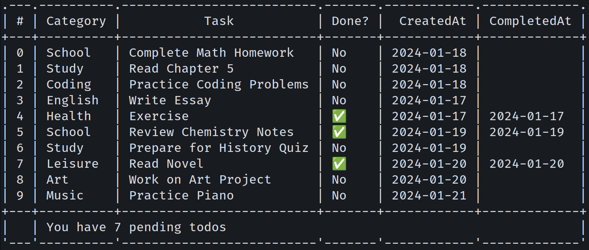

# 🄶🄾 🄳🄾 🄸🅃
> A golang cli program to manage your tasks.



## Installation

Clone the repo:
```
git clone https://github.com/vickybesra/GoDoIt.git
```

Build the program:
```sh
cd GoDoIt
go build -o godoit
#see usage
```

## Usage

Use it to manage your task. Catergorize your task. Maintain all of your tasks history.
```
GoDoIt <command> [arguments]
Available commands:
   add <task> <cat>    		 Add a new task
   list <done>         		 List all tasks
   update <id> <task> <cat>	 Update an existing task
   delete <id>         		 Delete an existing task
   help                		 Show this help message
```  
```sh
#displays task
./godoit list 
#Add task
./godoit add --task "Gym" --cat "After 4pm"
#delete task
./godoit delete --id 2
#update
./godoit update --id 2 --done
```

## Meta

Distributed under the MIT License. See ``LICENSE`` for more information.

## Contributing

1. Fork it (<https://github.com/vickybesra/GoDoIt/fork>)
2. Create your feature branch (`git checkout -b feature/colorText`)
3. Commit your changes (`git commit -am 'Add some colorText'`)
4. Push to the branch (`git push origin feature/colorText`)
5. Create a new Pull Request

